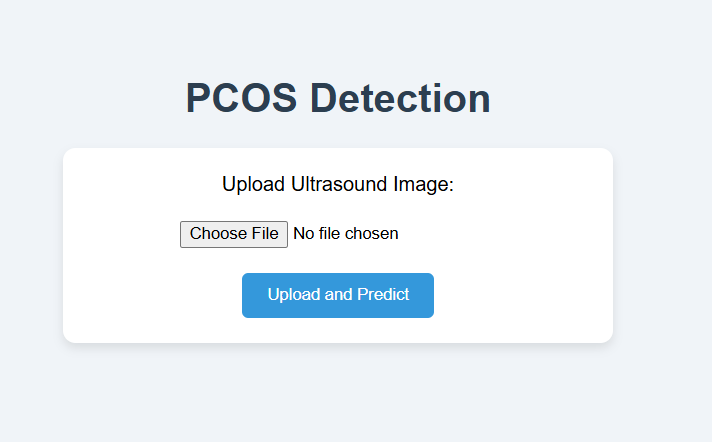
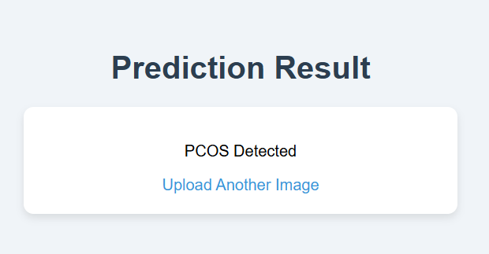
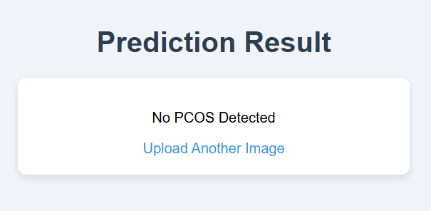
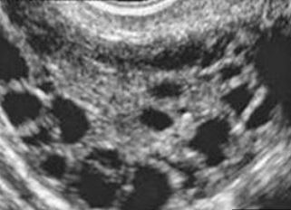
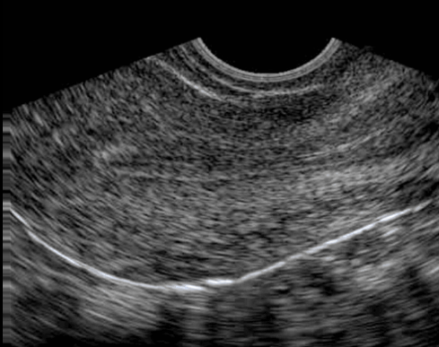

# Ovaa.ai 🩺✨  
Early Detection of PCOS using Deep Learning on Ultrasound Images  

---

## 📌 About the Project  
Ovaa.ai is a deep learning–based project designed to assist in the **early detection of Polycystic Ovary Syndrome (PCOS)** through ultrasound images.  
The goal is to provide an easy-to-use platform where users can upload an image and instantly know whether PCOS is detected or not.  

---

## 🚀 Features  
- Upload ultrasound images and get instant prediction (PCOS Detected / Not Detected).  
- Achieved **99.24% model accuracy** on the dataset.  
- Web integration for smooth user interaction.  
- Simple interface for non-technical users.  

---

## 📂 Model Access  
The trained deep learning model can be accessed here:  
🔗 [Download Model (Google Drive)](https://drive.google.com/file/d/1cYs0qolWtrwhefeulq4SprNsCSgvSWUG/view?usp=sharing)  

---

## 🖼️ Screenshots  

### PCOS Portal (Main Page)  
  

### Prediction Results  
**PCOS Detected** ✅  
  

**PCOS Not Detected** ❌  
  

**PCOS Positive (Sample)**  
  

**PCOS Negative (Sample)**  
  

---

## ⚙️ Tech Stack  
- **Python** (TensorFlow, Keras, NumPy, Pandas)  
- **Deep Learning (CNN)**  
- **Flask** for Web Integration  
- **VS Code + GitHub** for development & version control  

---

## 👨‍💻 Author  
Developed by **Siddhant**  
